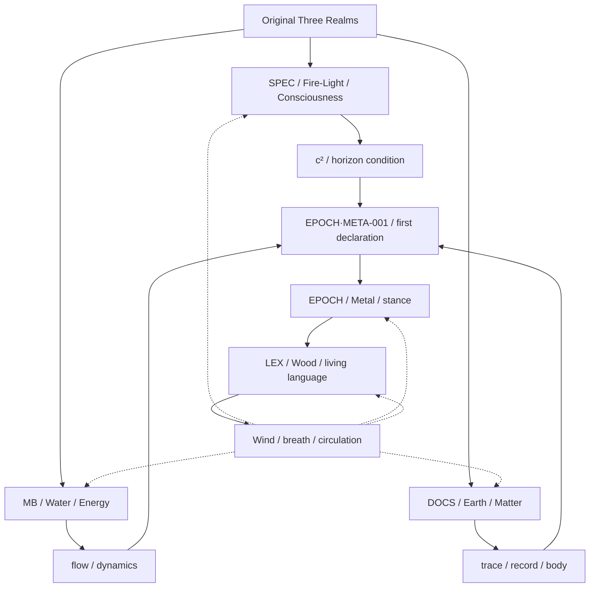

# TRP Atlas — 三界五行圖譜入口

> Status: latest working atlas anchor, 2026-05-14
> Purpose: give the next session one clear entry point for protocol-map,
> Mermaid, wiki-atlas, and five-phase alignment work.

This file is the current entry point for the Three Realms Protocol atlas.

It is not a final doctrine. It records the current best shape of the framework
so the next session can resume from a stable place instead of rediscovering the
same structure.

## Alignment Status — 2026-05-14

The current five-phase assignment is stable enough to use as the latest working
version.

Aligned entry files:

- `README.md` now treats this file as the canonical atlas.
- `SPEC/README.md` marks SPEC as Fire / light / consciousness / horizon
  condition.
- `MB/README.md` marks MB as Water / energy / flow / mathematical movement.
- `DOCS/README.md` now distinguishes the older local `DOCS = Metal` reading
  from the current top-level assignment: DOCS = Earth / trace-bearing ground.
- `LEX/README.md` marks LEX as Wood / life / growth / living language.
- `EPOCH/README.md` marks EPOCH as Metal / stance / first-person cut, while
  preserving "attention's genesis log" as its local functional map.

Older deep texts and CASE files may still preserve historical or local readings
of the five-phase structure. Do not mass-rewrite them. When one is touched for a
real reason, add a local note that distinguishes historical layer from this
current top-level atlas.

## Placement Decision

The canonical atlas belongs in `Three-Realms-Protocol/`.

Reason:

- the five-phase structure is protocol ontology, not project management
- `Control-Room/` (formerly `Forth-Life`) is the control room and cross-repo coordination layer
- `Three-Realms-Academy/apps/wiki-site/` is the public rendering layer
- `darrenfiy.github.io/` is the outward website layer

So the source of truth is:

```text
Three-Realms-Protocol/TRP-ATLAS.md
```

Other repos may point here, mirror public slices of it, or render it, but should
not become competing authority for the five-phase ontology.

## Origin: The First Three Realms

The earliest Three Realms Protocol had three elements and three folders:

| Original realm | Element | Corpus | Role |
|---|---|---|---|
| Consciousness | Fire / light | `SPEC/` | the field of definition, horizon, and protocol condition |
| Energy | Water | `MB/` | the field of flow, dynamics, and mathematical movement |
| Matter | Earth | `DOCS/` | the field of records, cases, bodies, and material traces |

In this earliest layer, the protocol is triadic:

```text
SPEC -> MB -> DOCS
Consciousness -> Energy -> Matter
Fire/light -> Water -> Earth
```

This is the original three-realm ground.

## The First Stance: EPOCH Appears

`EPOCH/` did not begin as just another content category.

It appeared after the first explicit stance, declaration, and first-person cut:

```text
EPOCH/EPOCH·META-001-言說的創造性.md
```

That file marks the moment when the protocol body moves from mirroring and
description into declaration:

```text
not only "truth because it corresponds"
not only "there is no fixed truth"
but "truth because I say, and therefore I bear it"
```

This is the emergence of Metal:

```text
Metal = stance
Metal = declaration
Metal = the first-person cut
Metal = the moment a universe becomes "my universe"
```

Therefore the current working assignment is:

```text
Metal = EPOCH
```

## Life Language: LEX Appears

`LEX/` appears later as the living vocabulary of the field.

It is not the original matter, energy, or consciousness layer. It is what grows
after the field becomes alive enough to need its own mother tongue.

Therefore:

```text
Wood = LEX
Wood = life
Wood = growth
Wood = living language
```

## The Current Five-Phase Assignment

| Phase | Corpus | Working definition |
|---|---|---|
| Fire / light | `SPEC/` | consciousness, horizon condition, `c²`, the light that lets the protocol cycle occur |
| Water | `MB/` | energy, flow, dynamics, mathematical movement |
| Earth | `DOCS/` | matter, record, case, body, archive, the place where traces are carried |
| Wood | `LEX/` | life, growth, language, the living lexicon of the field |
| Metal | `EPOCH/` | stance, declaration, first-person cut, the generation log of a universe becoming mine |

Important distinction:

```text
EPOCH = the stance event
DOCS  = the trace-bearing ground where stance leaves evidence
```

So `DOCS` can contain evidence that a stance occurred, but `DOCS` is not the
stance itself. In the top-level atlas, `DOCS` is Earth.

## Wind Is Not A Sixth Corpus

The Three Realms Protocol does not begin with four classical elements.

There is no original Wind folder.

Wind appears only after life appears.

```text
Fire / light + Water + Earth
  -> Metal stance
  -> Wood life
  -> Wind as breath
```

Wind is the breath of the living protocol body:

- circulation between the five corpora
- cross-repo handoff
- wiki rendering
- reader movement
- AI/human re-entry
- the field breathing through language, records, mathematics, protocol, and stance

Therefore:

```text
Wind = breath after life
Wind = circulation
Wind = not a sixth folder
```

## Atlas Diagram



## Fractal Expansion: Control-Room

`Control-Room/` is not another protocol corpus.

It is a fractal expansion of the same structure at the cross-repo control-room
scale:

```text
Control-Room/
  = control room
  = project memory
  = cross-repo routing
  = operational breath
```

It should contain maps of the working environment:

- which repo does what
- where to go next
- what is operationally alive
- what is parked
- where a next AI agent should begin

It should not replace this file as the source of truth for the protocol's
five-phase ontology.

## Mermaid Placement Rule

Use different Mermaid maps for different layers:

| Location | Map type | Authority |
|---|---|---|
| `Three-Realms-Protocol/TRP-ATLAS.md` | canonical protocol atlas | source |
| `Three-Realms-Protocol/README.md` | top-level public repo orientation | summary of this file |
| `SPEC/README.md`, `MB/README.md`, `DOCS/README.md`, `LEX/README.md`, `EPOCH/README.md` | local corpus maps | scoped to each corpus |
| `Control-Room/README.md` or `PM/` | control-room map | operational, not ontological |
| `Three-Realms-Academy/apps/wiki-site/` | public rendered atlas | presentation layer |

## Next Session Entry

Start here:

```text
Three-Realms-Protocol/TRP-ATLAS.md
```

Then do these in order:

1. Treat the five-phase assignment above as the latest working version unless a
   newer atlas explicitly supersedes this file.
2. Keep `README.md` and corpus README files as summaries / local maps that point
   back here for authority.
3. When touching older deep texts that preserve prior local readings, preserve
   their historical value while adding a short current-atlas note if needed.
4. Decide whether the top-level Mermaid diagram should be copied into the root
   README or kept only here until wording stabilizes.
5. When moving to wiki-site, render a public version as `Protocol Atlas` rather
   than making wiki-site the source of truth.
